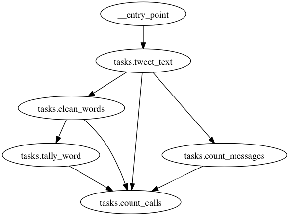

Command Line Utilities
======================

emit_digraph - Generate Graph Images
------------------------------------

Emit ships with a command-line program to inspect a graph: ``emit_digraph``.
Use it to generate graphs like this:

``emit_digraph`` will output the code graphviz needs to properly generate the
graph. (You'll need graphviz_ installed on your machine for this to render
properly.) To use it, pass it the path of your router. (for example,
``emit_digraph app.router`` in the Celery example.) The output should look
something like this::

    digraph router {
    "tasks.clean_words" -> "tasks.tally_words";
    "tasks.clean_text" -> "tasks.clean_words";
    "tasks.tweet_text" -> "tasks.count_messages";
    "__entry_point" -> "tasks.tweet_text";
    }

to make graphviz generate a PNG of the graph, pipe it into the following command::

    emit_digraph app.router | dot -T png -o graph.png

.. _graphviz: http://www.graphviz.org/
