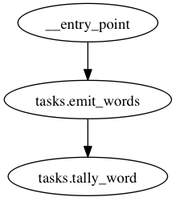

Using Celery to Distribute Processing
=====================================

.. warning::
   Celery doesn't work quite right under Python 3.3. It works fine under
   2.6-3.2 and pypy. Follow `Bug 1107 on Celery
   <https://github.com/celery/celery/issues/1107>`__ for progress.

Emit makes it simple to use celery to distribute realtime processing across
many worker nodes. To demonstrate this, we'll be scaling our quickstart example 

We'll be making, in essence, this graph:

Setting up Celery
-----------------

Create an ``app.py`` file for your celery initializaition code to live in:

.. literalinclude:: ../../examples/celery/app.py
   :language: python
   :linenos:

Take note that ``Router`` is initialized using the default celery task in this
case. This is probably the best way to do it, since per-task settings should
belong in the task (possible in Emit's decorator), and app-level configuration
should be on the ``app`` object (as on line 10).

Next we'll define (in ``tasks.py``) a function to take a document and emit each
word:

.. literalinclude:: ../../examples/celery/tasks.py
   :language: python
   :lines: 5-8

We don't have to give any special syntax to get these tasks to work with
celery: since we specified it in the router, they just do.

However, if you want to give special celery attributes to a particular
function, you can do that too:

.. literalinclude:: ../../examples/celery/tasks.py
   :language: python
   :lines: 11-14

Obviously rate limiting to 5 per second in this case is a bit contrived, but
you get the general idea: it's easy to configure tasks within the decorator by
passing in the celery decorator.

The available parameters:

+-----------------+---------+------------------------------------------+
| parameter       | default | effect                                   |
+=================+=========+==========================================+
| ``celery_task`` | None    | override the supplied celery task with a |
|                 |         | node-specific tas                        |
+-----------------+---------+------------------------------------------+

Running the Graph
-----------------

We'll need to boot up the celery daemon:

.. literalinclude:: ../../examples/celery/run.sh
   :language: sh

And enter the following on the command line to start something fun processing
(if you'd like, the relevant code is in ``examples/celery/kickoff.py`` in the
project directory, start it and get a prompt with ``ipython -i kickoff.py``):

.. literalinclude:: ../../examples/celery/kickoff.py
   :language: python

You should get something like the following:

.. code-block:: python

   ({'word': 'the'},
    {'word': 'spain'},
    {'word': 'in'},
    # ...
    {'word': 'falls'},
    {'word': 'falls'},
    {'word': 'mainly'})

And you should see the celery window quickly scrolling by with updated totals.
Run the command a couple more times, if you like, and you'll see the totals
keep going up.
