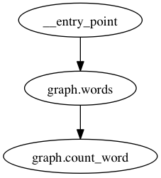

Getting Started
===============

After reading this document you'll have a good idea of what you need to do to
get your first emit graph running, both in local memory and Celery.

Installing
----------

Eventually, you'll be able to install via `pip`. However, while the library is
under initial development you'll need to install via git::

    pip install -e git+git@github.com:BrianHicks/emit.git#egg=emit

Quickstart
----------

For a sampler, we're going to make a simple command-line application that will
take and count all the words in a document, giving you the top 5.

Put the following into `graph.py`

.. literalinclude:: ../examples/simple/graph.py
   :language: python
   :linenos:

(incidentally, this file is available in the project directory as
``examples/simple/graph.py``.)

Now on the command line: ``echo "the rain in spain falls mainly on the plain" |
python graph.py``. You should get some output that looks similar to the
following

.. literalinclude:: ../examples/simple/output.txt
   :language: text

Breaking it Down
""""""""""""""""

First, we need to construct a router:

.. literalinclude:: ../examples/simple/graph.py
   :language: python
   :lines: 6

Since we're keeping everything in-memory, we don't need to specify anything to
get this to work properly. It should "Just Work(TM)".

Next, we define a function to split apart a document on spaces to get words:

.. literalinclude:: ../examples/simple/graph.py
   :language: python
   :lines: 13-17

``Router`` provides a decorator. The first argument is the fields that the
decorated function returns. These are wrapped in a message and passed around
between functions.

We don't specify any subscriptions on this function, since it really doesn't
need any. In fact, it's an entry point, so we specify that instead. This
specifically means that if you call the router directly it will delegate to
this function. There can be multiple functions with ``entry_point`` set to true
on a given ``Router``.

If the decorated function is a generator, each yielded value is treated as a
separate input into the next nodes in the graph.

Splitting the document into parts is only as useful as what we can do with the
words, so let's count them now:

.. literalinclude:: ../examples/simple/graph.py
   :language: python
   :lines: 20,23-30

There's a little less going on in this function. We just update a ``Counter``
builtin, and then return the word and the count to be passed down the graph. In
real life, you'd probably persist this value in a database to allow multiple
workers to process different parts of the stream.

In non-entry nodes, the second argument of ``router.node`` is a string or list
of functions to subscribe to. These need to be fully qualified when you're
using Celery, but for now they're fine.

Now that we've defined both functions, it's time to send some data into our
graph:

.. literalinclude:: ../examples/simple/graph.py
   :language: python
   :lines: 33

Calling this graph is easy, since we defined a function as an entry point. You
can call any of the functions (or the router itself) by using keyword arguments
or passing a dictionary.

In the end, data flows through the graph like this:

