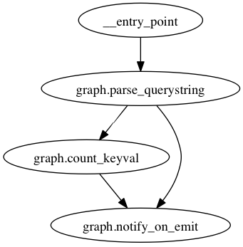

Regex Routing
-------------

You can subscribe to arbitrary node's output by providing a regular expression.
In this example, we'll use Redis' pubsub capabilities to notify an external
receiver of all tasks passing through the graph.

The product of this example is in ``examples/regex/graph.py``.

First, we'll create a function that yields multiple return values. In this
case, we're going to naively parse a HTTP querystring.

.. literalinclude:: ../examples/regex/graph.py
   :language: python
   :lines: 11-16

Now we're going to count keys and values:

.. literalinclude:: ../examples/regex/graph.py
   :language: python
   :lines: 18-21

Next, we'll make a function that publishes to Redis on every message:

.. literalinclude:: ../examples/regex/graph.py
   :language: python
   :lines: 23-26

Now, when you call ``router(querystring='?a=1&b=2&c=3')``, ``notify_on_emit``
will publish seven messages: three with origin "graph.parse_querystring", three
with origin "graph.count_keyval", and one with origin "__entry_point". The
graph ends up looking like this:

