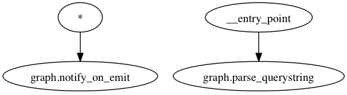

Star Routing
------------

You can subscribe to be notified of every function's output by creating a node
with a star (``*``) subscription. In this example, we'll use Redis' pubsub
capabilities to notify an external receiver of all tasks passing through the
graph.

The product of this example is in ``examples/star/graph.py``.

First, we'll create a function that yields multiple return values. In this
case, we're going to naively parse a HTTP querystring.

.. literalinclude:: ../examples/star/graph.py
   :language: python
   :lines: 8-13

Next, we'll make a function that publishes to Redis on every message:

.. literalinclude:: ../examples/star/graph.py
   :language: python
   :lines: 15-18

Now, when you call ``router(querystring='?a=1&b=2&c=3')``, ``notify_on_emit``
will publish four messages: three with origin "graph.parse_querystring", and
one with origin "__entry_point". The graph ends up looking like the following:

It appears to be disconnected, but will route properly.
